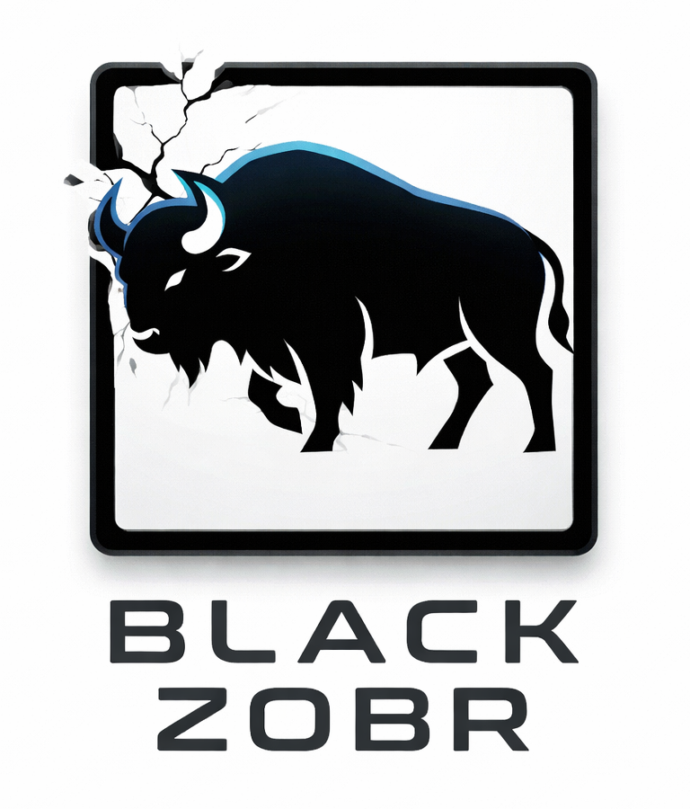

<p align="center">
  
</p>

<h1 align="center">ZS (Zobr Script)</h1>

<p align="center">
  A cognitive scripting language for structured reasoning with LLMs
</p>

---

ZS provides formal constructs for describing reasoning processes — not as rigid instructions, but as composable cognitive operations with variables, control flow, and result formatting.

Think of it as **SQL for thinking**: you define *what* cognitive steps to take, the LLM decides *how* to execute them.

Scripts are executed by an LLM as interpreter: the model reads a `.zobr` file, executes operations step by step, tracks variables, follows control flow, and produces structured output.

[](https://glama.ai/mcp/servers/docxi-org/zobr-script)

## Quick Example

```
task: "Evaluate risks of AI in education"

risks = survey("main risks of AI in education", count: 4)
evidence = for r in risks {
  concrete = ground(r, extract: [examples, studies])
  yield { risk: r, evidence: concrete }
}
overview = synthesize(evidence, method: "rank by severity")

result = conclude {
  top_risks: list
  most_critical: string
  recommendation: string
  confidence: low | medium | high
}
```

## 12 Built-in Cognitive Operations

Operations are organized into five categories:

**Discovery** — explore and extract

| Operation | Description |
|-----------|-------------|
| `survey(topic, count?)` | Explore a topic and identify key elements — positions, factors, perspectives |
| `ground(claim, extract?)` | Connect a claim to concrete evidence, facts, or experience |

**Argument** — reason and challenge

| Operation | Description |
|-----------|-------------|
| `assert(thesis, based_on?)` | State a position with reasoning |
| `doubt(target)` | Problematize a claim — find weaknesses, hidden assumptions, edge cases |
| `contrast(target, with?)` | Find or construct the strongest opposing position or counterexample |
| `analogy(target, from?)` | Transfer understanding from another domain to reveal hidden structure |

**Synthesis** — combine and transform

| Operation | Description |
|-----------|-------------|
| `synthesize(sources, method?)` | Combine multiple findings into emergent insight (not just a summary) |
| `reframe(target, lens?)` | Reformulate a problem in different terms, change the analytical lens |

**Meta** — reflect and steer

| Operation | Description |
|-----------|-------------|
| `assess(scale?)` | Reflective pause — evaluate the current state of reasoning (open/converging/stuck) |
| `pivot(reason)` | Explicitly change reasoning strategy when the current approach is insufficient |
| `scope(narrow\|wide)` | Control analytical zoom — from specific mechanisms to systemic connections |

**Output**

| Operation | Description |
|-----------|-------------|
| `conclude { ... }` | Define the structure and format of the final result |

Plus: variables, `for`/`if`/`loop` control flow, user-defined functions (`define`), `yield`, `import`, `@last`/`@N` references.

## `zobr-check` — Static Validator

The package includes a CLI tool for static validation of `.zobr` scripts:

```bash
# Install from source
git clone https://github.com/docxi-org/zobr-script.git
cd zobr-script
npm install && npm run build

# Validate a script
node dist/cli.js script.zobr
```

The validator checks:
- Syntax correctness (PEG grammar)
- Undefined variable references
- Correct operation signatures (positional/named argument counts)
- Unused variables (warnings)
- Reserved word misuse

## How It Works

In the current version, a ZS script is executed by an LLM as interpreter:

1. Provide the [language spec](docs/spec.md) and [system prompt](docs/system-prompt.md) as context — together they define the full operation semantics, control flow rules, and output format
2. Pass a `.zobr` script as the task
3. The LLM executes operations step by step, tracking variables and following control flow
4. Output is structured according to the `conclude` block

## MCP Server

Connect ZS to Claude, Claude Desktop, or any MCP client — no installation needed.

**MCP endpoint:** `https://zobr-script-mcp.docxi-next.workers.dev/mcp`

In claude.ai: Settings → Connectors → Add custom connector → paste the URL above.

Tools provided:
- `zs_execute` — feed a script, get full spec + interpreter context injected automatically
- `zs_validate` — full PEG parser + semantic validation (same as `zobr-check`)
- `zs_operations` — quick reference for all 12 operations

Also available on [Smithery](https://smithery.ai/servers/zobr-script/zobr-script).

## Benchmark Results

Tested with three Claude models across 5 tasks of increasing complexity:

| Model | Composite Score | Structural Compliance | Content Quality | Generation Quality |
|-------|:-:|:-:|:-:|:-:|
| **Claude Opus 4.6** | **9.4** / 10 | 9.8 | 9.4 | 9.0 |
| **Claude Sonnet 4.6** | **9.3** / 10 | 9.7 | 9.3 | 9.0 |
| **Claude Haiku 4.5** | **7.9** / 10 | 9.3 | 7.0 | 7.5 |

Key findings:
- **Structure compresses the capability gap**: Sonnet achieves near-parity with Opus (9.3 vs 9.4) — when reasoning structure is provided by the script, the model's job shifts from *organizing thought* to *filling containers with content*
- **Even the smallest model follows scripts with 93% structural fidelity**: ZS is a reasoning amplifier, not a capability test
- **All models generate valid scripts**: Task 05 (script generation) produced 0 syntax errors across all models

Full results: [benchmark report](tests/results/evaluation/result.md) ・ [infographic](https://docxi-org.github.io/zobr-script/tests/results/evaluation/infographic.html) ・ [на русском](tests/results/evaluation/result-ru.md) ・ [инфографика](https://docxi-org.github.io/zobr-script/tests/results/evaluation/infographic-ru.html)

## Use Cases

- **Repeatable analysis patterns** — encode your best analytical workflow once as a `.zobr` script, apply it to any new input
- **Quality assurance for AI reasoning** — auditable operations with visible variable flow, not black-box responses
- **Cost optimization via model routing** — use smaller models for structural tasks, larger models only where depth matters
- **Knowledge capture** — distill exceptional AI reasoning into reusable `.zobr` artifacts
- **Education & critical thinking** — externalize the structure of rigorous thinking: survey before asserting, doubt your own claims, contrast with the strongest counter
- **Multi-agent cognitive workflows** — scripts as shared protocols between agents

## What ZS Is Not

- Not a prompt template engine (see [POML](https://github.com/microsoft/poml))
- Not an LLM orchestration framework (see [DSPy](https://dspy.ai/), [LangChain](https://langchain.com/))
- Not chain-of-thought prompting

ZS operates at a different level: it formalizes **cognitive operations themselves** as first-class language constructs.

## Documentation

- [Language Specification v0.1](docs/spec.md)
- [System Prompt for LLM Interpreter](docs/system-prompt.md)
- [Test Tasks](tests/tasks/)
- [Benchmark Report](tests/results/evaluation/result.md) ・ [на русском](tests/results/evaluation/result-ru.md)

## Status

Spec v0.1. Benchmark complete (3 models × 5 tasks). Static validator shipped.

## License

Apache License 2.0 — see [LICENSE](LICENSE)

---

Part of the [Black Zobr](https://github.com/docxi-org/black-zobr) ecosystem.